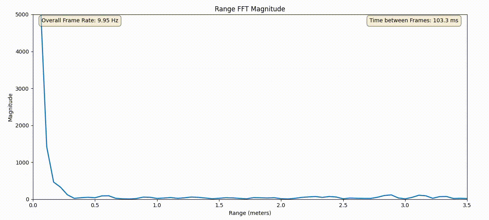

# mmwave-spi-ftdi-reader
An unofficial Python library for streaming and parsing 1D Radar Cube data from TI mmWave sensors via SPI using an FTDI adapter, currently focused on data from the [`ti_iwrl6432_spi_data_stream`](https://github.com/loeens/ti_iwrl6432_spi_data_stream/tree/spi-data-streaming) project.


## Project Description
This project provides a Python interface to read and interpret 1D radar cube data streamed over SPI in real-time*. It is designed to work with setups where a TI mmWave sensor outputs processed radar cube data via SPI synchronized using a GPIO pin, and connected to a host PC via an FTDI USB-to-SPI adapter (such as the C232HM-DDHSL-0).

**Note:** As of the current version, this library is specifically designed to consume the radar cube data format output by the firmware found in the repository [`ti_iwrl6432_spi_data_stream`](https://github.com/loeens/ti_iwrl6432_spi_data_stream). It currently **only supports the TI IWRL6432BOOST** and does not support other data sources or formats out-of-the-box.

The library handles the low-level SPI communication and synchronization using the `pyftdi` library and parses the raw byte streams into structured data using `numpy` and `xarray` for easy handling and analysis of the radar cube dimensions.

## Features
* **SPI communication:** 
    - no proprietary drivers: Interfaces with FTDI-based SPI adapters using `pyftdi`, not requiring any proprietary drivers or DLLs
    - low-cost hardware: Requires only the TI IWRL6432BOOST evaluation module and a standard FTDI USB serial cable (C232HM-DDHSL-0), offering an affordable entry into mmWave radar

* **Radar Cube streaming in real-time:** 
    - easy setup
    - continuously reads radar cube data based on a configured length and stores them in a `RadarCube1D` object
    - `RadarCube1D` is essentially a `xarray.DataArray`, allowing for easy accessibility of the cube's dimensions

* **Should be also compatible with [OpenRadar](https://github.com/PreSenseRadar/OpenRadar) project's libraries:** 
    - since the cube's data can be accessed as a NumPy array with `cube.data.values`, it should be fully compatible with the subsequent processing functions offered by the [OpenRadar](https://github.com/PreSenseRadar/OpenRadar) GitHub project (still needs verification!)
    
 
## Limitations
* **Real-time operation** is limited to a certain `Radar Cube Size` or `framePeriodicity` (time period between successive frames) or `Compliance Chirp Time`. Let me explain:
    - SPI set at 30 MHz enables theoretical throughput rates of 30 MBit/s. So if your `Radar Cube size` is at 100 kByte, it will theoretically take: 
        ```
        Transfer Time = 100 kByte / (30 MBit/s / 8) = ~27ms
        ```
        to transfer. Realistically it is more around 35ms to 40ms with this setup.
    - `framePeriocicity` is the time between successive frames, while the `Compliance Chirp Time` is the time within which chirping takes place. The latter is calculated as:
        ```
        Compliance Chirp Time = burstPeriodicity * numOfBurtstsInFrame
        ```
    - in summary, for real-time operation, meaning that you receive your radar cube within the `framePeriodicity` duration, the following expression must be fullfilled:
        ```
        Transfer Time < (framePeriodicity - Compliance Chirp Time)
        ```
        This can be achieved by decreasing the `Compliance Chirp Time` or increasing the `framePeriodicity` or downsizing the `Radar Cube Size` (e.g. by reducing number of antennas, number of range bins, number of chirps, etc.). In order to play around with these values, please refer to the [mmWave Sensing Estimator](https://dev.ti.com/gallery/view/mmwave/mmWaveSensingEstimator/ver/2.4.1/) (tab "Advanced Chirp Design and Tuning").

* **Device support** is as of now limited to only the IWRL6432BOOST, as I do not have access to any other device.

* **Radar Cube data processing only** as previously mentioned.

* **Limitations for Windows** due to `pyftdi` only being officially supported on Linux and MacOS. Although there seem to be workarounds, please refer to the [official pyftdi installation documentation](https://eblot.github.io/pyftdi/installation.html).

## Usage
### Simple example
Make sure to adjust the parameters of the `RadarCubeReader` to your chirp parameters and FTDI device.
```python
from mmwave_spi_ftdi_reader import RadarCubeReader

# set up the reader
reader = RadarCubeReader(
    num_tx_antennas=2,
    num_rx_antennas=3,
    num_range_bins=64,
    num_chirps_per_frame=128, 
    spi_uri="ftdi://ftdi:232h/1?latency=1"
)

# continuously get radar cube data
for cube in reader:
    print(cube.data)
```

Access the Radar Cube's dimensions
```python
# get all rangebins across all antennas but from first chirp only
chirp0      = cube.data.isel(doppler_chirp=0)
# get all rangebins across all chirps but from second virtual antenna only
ant1        = cube.data.isel(virt_antenna=1)
# get 17th rangebin across all chirps and antennas
rangebin16  = cube.data.isel(rangebin=16)
# get range profile from first chirp and first antenna
rangeprof0  = cube.data.isel(doppler_chirp=0, virt_antenna=0)
```
### example.py
For a full example, please refer to the `example.py` script which displays a range 
profile from one chirp and one antenna of each radar cube.



## Installation

1. **pyftdi installation:**
The `pyftdi` library requires prerequisites to access the FTDI device. Please follow the instructions below for your operating system. Refer to the [official pyftdi installation documentation](https://eblot.github.io/pyftdi/installation.html) for the most up-to-date information.

2. **Clone the repository:**
    ```bash
    git clone https://github.com/loeens/mmwave-spi-ftdi-reader
    cd mmwave-spi-ftdi-reader
    ```

3. **Install the Python module and dependencies:**
    ```bash
    pip install .
    ```
## FAQ
### Why stream Radar Cube data and not ADC data?
The Rangeproc DPU efficiently calculates the Range-FFT during the `framePeriodicity` (which at minimum is 100ms on the IWRL6432). Therefore the calculation of the Range-FFT doesn't add up on the processing time required for each frame on the host computer. Streaming of ADC data from TI's demo project is planned for a future update though.

